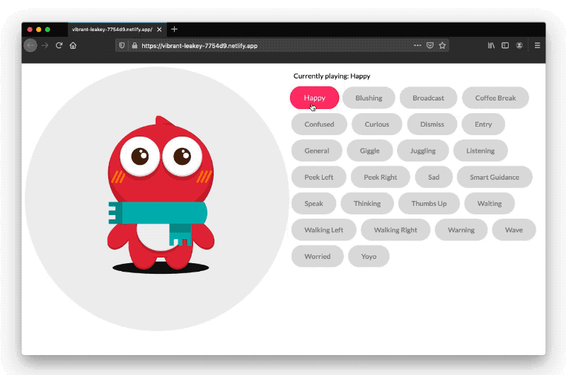

I was asked to create a series of character animations for a TV interface. Once I was finished other designers used these to specify different animation sequences in several scenarios throughout the system.

I created this tool to help everyone quickly preview and prototype their own sequences. The application is web based so its easy enough to use it and works in desktop and mobile.

The animations were created in After Effects and exported as JSON files using Lottie-web. The application was created in React to preview and play all these animations with ease.

Live source code is also available at: https://stackblitz.com/edit/react-fo8gzf

A live prototype of the application is available at: https://vibrant-leakey-7754d9.netlify.app/
